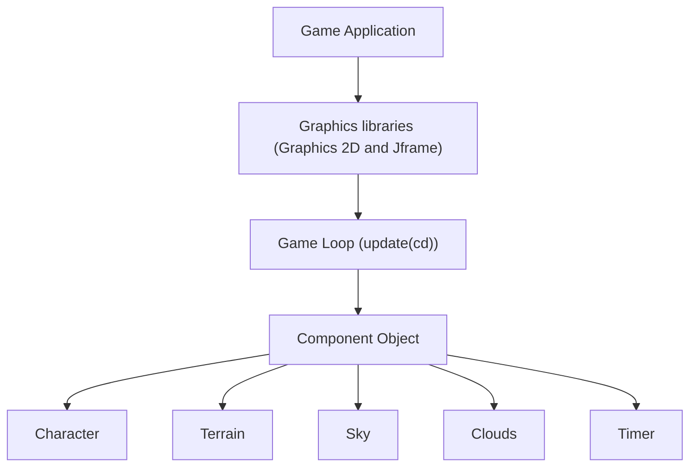

  <h1>🎮 Pixel Engine</h1>

  

    <strong>A lightweight, cross-platform 2D game engine built in Java.</strong>
  

  <!-- BADGES -->

  

    <a href="#-features">Features</a> •
    <a href="#-architecture">Architecture</a> •
    <a href="#-getting-started">Getting Started</a> •
    <a href="#-quick-example">Code Example</a>
  

 

<!-- DEMO / SCREENSHOT -->

  

---

## ⚡ Features

- 🎨 **Batch Renderer:** Optimized 2D quad and sprite rendering.
- ⚙️ **Entity Component System (ECS):** Flexible, cache-friendly entity management.
- 📐 **Collision System:** Rigid-body Collision.

---

## 🏗 Architecture Overview

