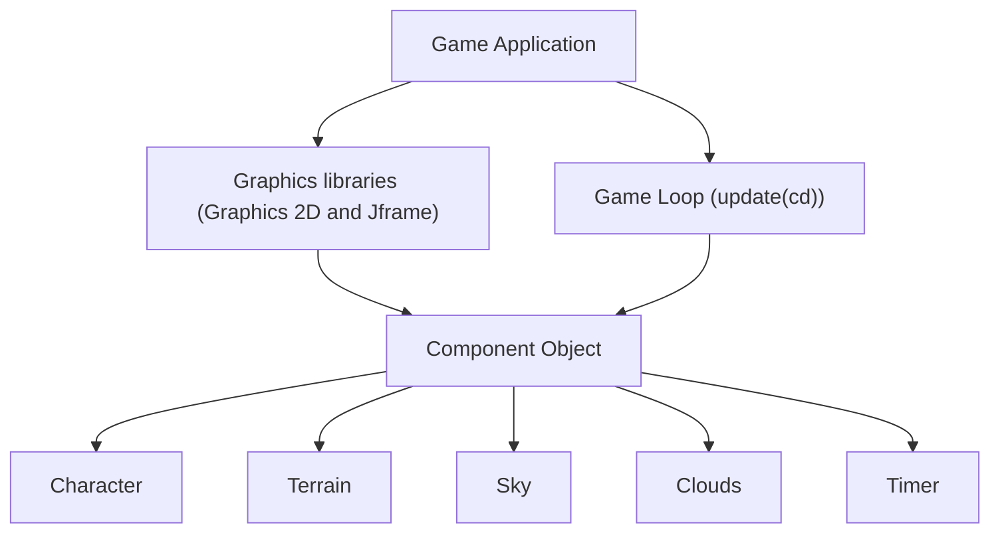

  <h1 align="center">🎮 Pixel Engine</h1>

  

    <strong>A lightweight, cross-platform 2D game engine built in Java.</strong>
  

  <!-- BADGES -->

  

    <a href="#-features">Features</a> •
    <a href="#-architecture">Architecture</a> •
    <a href="#-getting-started">Getting Started</a> •
    <a href="#-quick-example">Code Example</a>
  

 

<!-- DEMO / SCREENSHOT -->

  

---

## ⚡ Features

- 🎨 **Batch Renderer:** Optimized 2D quad and sprite rendering.
- ⚙️ **Entity Component System (ECS):** Flexible, cache-friendly entity management.
- 📐 **Collision System:** Rigid-body Collision.

---

  

## 🏗 Architecture Overview

## 🛠 Tech Stack & Dependencies

- **Language:** JAVA 27
- **Libraries:** Swing and AWT (Should be built in JAVA)

---
### Prerequisites

- Ensure you have a JAVA 27 compatible IDE and JAVA 27, Also JDK HAS to be installed (if you want to add new things)

## 🚀 Getting Started

- Make sure you have the whole project downloaded or else some assets could be missing
- I didn't make an executable so it can only be ran through an IDE
- Can be easily tinkered with using the Component object, just create a new Object, extend it to Component and try it!

